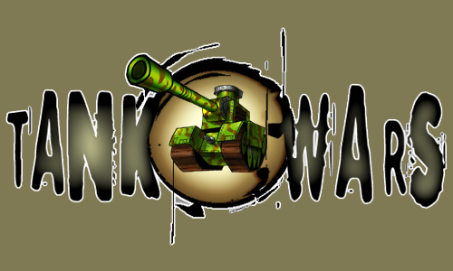
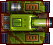
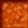
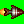
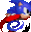

<h2 allign="center">Tank Game</h2>

SFSU 2021 Software Development Project

 

<h3 allign ="center"> What is Tank Game?</h3>
Tank Game is a Java Game application that allows two players to battle each other in a arena with power up items. 

<h3 allign ="center"> Rules:</h3>

<h3 allign="allign" >Tank Controls:</h3>

|               | Player 1 | Player 2 |
|---------------|----------|----------|
|  Forward      |     W     |    Up Arrow      |
|  Backward     |     S    |      Down Arrow    |
|  Rotate left  |     A     |     Left Arrow     |
|  Rotate Right |     D    |      Right Arrow    |
|  Shoot        |     Spacebar     |     Enter     |

<h3 allign="center">Enivornment</h3>

Indestrubile walls

Breakale walls with x Health points. 

<h3 allign = "center">Power ups</h3>

Rocket Launcher Power up: Changes normal shells into rockets for 5 shots.

Speed bost: Speed multipler on tank, and shell movement.

Health pack: Fully heals your tank. Will not grant extra lives if full HP.

<!-- you may add more controls if you need to. -->
