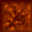

<h2 allign="center">Tank Game</h2>

SFSU 2021 Software Development Project

 

<h3 allign ="center"> What is Tank Game?</h3>
Tank Game is a Java Game application that allows two players to battle each other in a arena with power up items. 

<h3 allign ="center"> Rules:</h3>

<ol type="1" allign="center">
 <li>Each tank will have up to three lives, and each life has four health points. </li>
 <li>There will be two sets of power ups that will spawn once.</li>

<li> There are infinite number of normal shells you can shoot, and each normal shell will deal 1 damage. </li>
<li>You cannot go through walls. </li>
 </ol>

<h3 allign="center" >Tank Controls:</h3>

|               | Player 1 | Player 2 |
|---------------|----------|----------|
|  Forward      |     W     |    Up Arrow      |
|  Backward     |     S    |      Down Arrow    |
|  Rotate left  |     A     |     Left Arrow     |
|  Rotate Right |     D    |      Right Arrow    |
|  Shoot        |     Spacebar     |     Enter     |

<h3 allign="center">In game screenshot</h3>
<h4 allign="center">Title Screen</h2>

<h4 allign = "center">Match Start</h2>

<h3 allign="center">Enivornment</h3>

Indestrubile walls.

Breakale walls with 2 Health points. 

<h3 allign = "center">Power ups</h3>

Rocket Launcher Power up: Changes normal shells into rockets for 5 shots.

Speed boost: Tank will move twice as fast for a set duration. 

Health pack: Fully heals your tank. It will be consumed no matter what your health point is at. 

<!-- you may add more controls if you need to. -->
